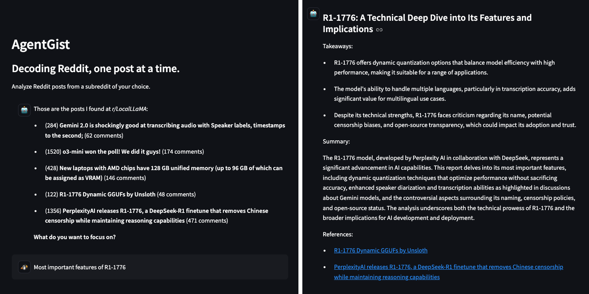

# AgentGist

Agentic workflow for analysing Reddit posts



Features:

- Analyze and report on the latest Reddit posts in a subreddit
- Agentic workflow with LangGraph (functional API)
- Tool calling - agent using semantic search (embeddings) to filter posts
- Human in the loop - specify which posts to analyze
- Uses Groq API for LLM inference
- Optimized with Groq's Accuracy-Preserving Strategies and Cost-Saving Components

## Agents

- [`Post Fetcher`](agentgist/agents/post_fetcher.py): fetches Reddit posts and associated comments
- [`Filter Query`](agentgist/agents/filter_query.py): asks the user on which posts to focus
- [`Post Analyzer`](agentgist/agents/post_analyzer.py): analyzes a given post (summary, takeaways, sentiment, etc.)
- [`Report Writer`](agentgist/agents/report_writer.py): writes a report based on the analysis of the posts and user query

## Groq Optimizations

AgentGist utilizes advanced Groq optimization techniques:

- **Dynamic Complexity Routing**: Automatically selects the most appropriate model based on task complexity
  - Simple queries use the general-purpose model
  - Complex report writing uses specialized models

- **Token Optimization Pipeline**: Reduces API costs through:
  - Prompt optimization that replaces verbose phrases with concise alternatives
  - Intelligent context truncation that preserves important information
  - Message preprocessing for token-efficient LLM calls

These strategies are implemented in the [`groq_strategies.py`](agentgist/groq_strategies.py) module.

## Install

Make sure you have [`uv` installed](https://docs.astral.sh/uv/getting-started/installation/).

Clone the repository:

```bash
git clone git@github.com:mlexpertio/agentgist.git .
cd agentgist
```

Install Python:

```bash
uv python install 3.12.8
```

Create and activate a virtual environment:

```bash
uv venv
source .venv/bin/activate
```

Install dependencies:

```bash
uv sync
```

Install package in editable mode:

```bash
uv pip install -e .
```

Install pre-commit hooks:

```bash
uv run pre-commit install
```

### API Key Setup

AgentGist uses the Groq API for LLM inference. You'll need to obtain an API key:

1. **Groq API Key**: Get your API key from https://console.groq.com/keys

Rename the `.env.example` file to `.env` and add your API key inside:

```bash
mv .env.example .env
```

Then edit the `.env` file to include:

```
GROQ_API_KEY=your_groq_api_key_here
```

The system is configured to use:
- Groq model "llama-3.1-70b-versatile" for general tasks and tool calling
- Groq model "deepseek-r1-distill-llama-70b" for complex report writing tasks

You can modify these settings in the [`config.py`](agentgist/config.py) file.


## Run the Streamlit app

Run the app:

```bash
streamlit run app.py